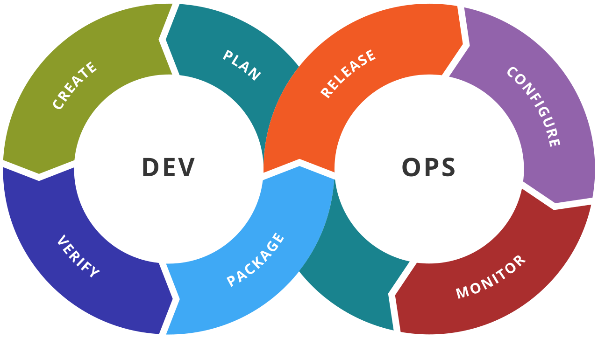

### READ_ME FILE

<picture></picture>

## Activities:
- git init
- README creation

| Task list | Date |
| ----- | ----- |
| Task 1 | *Scrum* and **DevOps** |
| Task 2 | Git and Github |

## Summary:
- add Oleh as reviewer
- create merge request